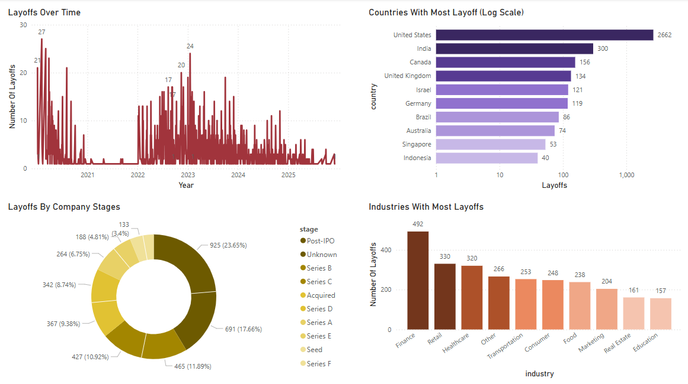

# Layoff Data Analysis

This analysis provides an interactive dashboard for analyzing global layoff trends across industries, regions etc. The goal is to help users understand the patterns and impact of layoffs over time through intuitive visualizations

## Table Of Contents

* Dataset Source  
* Technologies Used  
* Result And Discussion  
* Conclusion  

### Dataset Source

The dataset used in this analysis was sourced from Kaggle. It contains comprehensive information on layoffs, including details such as country, company, location, industry, number of employees laid off, date of layoffs and the stage etc from 2019 ownwards. The dataset was created and shared by swapnil thripathi. You can access the original dataset here: Kaggle Dataset Link https://www.kaggle.com/datasets/swaptr/layoffs-2022

### Technologies Used

Microsoft Excel : for data cleaning and organizing  

Microsoft Power BI : for data visualization

### Result And Discussion

Layoffs Over Time : Peaked around late 2020 and 2023, possible due to covid 19 and economic downtimes and declined through 2024 ownwards, also there is a low layoff count from 2021 to 22 due to post covid recovery boom   

Fund Raising By Company : The US dominates the fund raising suggesting US companies are primary drivers of the economy and the indian companies are at the second place  

Layoffs By Stages : Post-IPO, Series B and C are at the top, these staged companies are large enough to have significant headcount but may still be unprofitable, making them especially vulnerable when market condition tighten

Industry With Most Layoffs : Finance, retail and health care have higher layoffs, pointing to sector specific disruptions or overexpansion during earlier growth phase  

### Conclusion

This analysis provides a clear and interactive way to analyze global layoff trends using data visualization techniques. By leveraging real-world data, the dashboard offers valuable insights into industry patterns, company-level impacts, and regional differences. It can serve as a useful tool for businesses analysts and researchers to understand workforce dynamics and make informed decisions  

### Disclaimer
This analysis is based on a sample dataset from Kaggle and may not represent complete real-world data. The project is created for educational and portfolio purposes  

